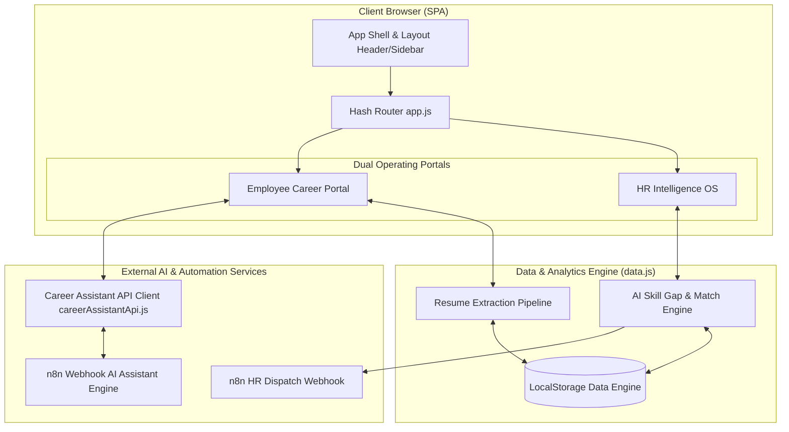

# ⚡ TalentPulse AI Enterprise Platform
### *AI-Powered HR Intelligence OS, Skill Gap Analysis & Career Mobility Platform*

[](https://github.com/praveen2007-VY/Buildathon_finals)
[](https://vitejs.dev/)
[](https://tailwindcss.com/)
[](https://n8n.io/)
[](LICENSE)

---

## 📖 Executive Summary

**TalentPulse AI Enterprise Platform** is a dual-portal HR Intelligence OS and Employee Career Growth ecosystem created for enterprise talent strategy, internal workforce mobility, and automated skill gap remediation.

By linking an **n8n AI Workflow Webhook Engine** with a multi-employee AI gap analysis matrix, TalentPulse empowers HR leaders to make data-backed talent decisions while providing employees with an intelligent career copilot, personalized learning roadmaps, and resume skill extraction.

---

## 🎯 Architecture Overview



---

## 🔥 Key Platform Modules & Features

### 👤 1. Employee Career Portal

* **🤖 AI Career Assistant (n8n Webhook Copilot)**:
  * Multi-turn conversational interface powered by `VITE_CAREER_ASSISTANT_WEBHOOK_URL`.
  * Contextual awareness passing employee role, department, ID, and conversation history.
  * 6 Instant-start action cards (*"What skills should I improve?"*, *"Find roles matching my profile"*, *"Create my learning roadmap"*, etc.).
  * Interactive modal overlays for **Fast-Track Learning Plans** and **Career Vector Progression Roadmap**.
  * File attachment preview and voice dictation UI.
* **📄 Resume Skill Extraction Pipeline**:
  * 5-Stage processing pipeline: File Upload ➔ Text Parsing ➔ AI Skill Extractor ➔ Skill Normalization ➔ Profile Auto-Sync.
  * Extracted skills automatically update the employee's verified competency database and proficiency scores.
* **🎯 AI Skill Profile & Competency Matrix**:
  * Visual competency matrix with proficiency sliders (0–100%).
  * Categorized skill tags (Languages, Data Architecture, Cloud/MLOps, Leadership).
* **💼 Internal Opportunity Marketplace**:
  * Job matching algorithm showing internal roles with instant % match scores.
  * Missing skill breakdown and 1-click internal mobility application.
* **📚 Personalized Learning & Growth**:
  * Tailored course recommendations (Enterprise AI Academy, DeepLearning.AI).
  * Progress tracking, hours logged, and completion certificates.

---

### 🏢 2. HR & Leadership Intelligence OS

* **🔬 Multi-Employee AI Skill Gap Analysis**:
  * Select single or multiple employees from the database and evaluate against targeted job requisitions.
  * Calculates match percentage, matched competencies, and missing skill gaps in real time.
* **⚡ Automatic Skill Assignment & Feedback Dispatcher**:
  * Automatically assigns missing skill tags to employee profiles.
  * Generates and dispatches custom development plans and feedback notifications directly to the employee's inbox.
  * Triggers downstream n8n Webhook automation payloads with complete evaluation telemetry.
* **📝 Job Requisition & Role Manager**:
  * Interface to post job openings, set required skill competencies, pay bands ($180k–$220k), and work location policies (Hybrid/Remote).
* **👥 Employee Management Directory**:
  * Central directory with quick search, filtering by department, and new employee onboarding forms.
* **📊 Workforce Analytics & Executive Reports**:
  * Departmental skill distribution, high-potential internal candidates, readiness index, and OKR tracking.

---

## 🛠️ Tech Stack & Technical Specifications

| Component | Technology | Description |
| :--- | :--- | :--- |
| **Frontend Framework** | Vanilla JavaScript (ES6+ Modules) | Lightweight, zero-framework SPA architecture |
| **Build Tooling** | [Vite 5.4](https://vitejs.dev/) | Fast HMR development server and production bundler |
| **CSS & Design System** | Tailwind CSS v3 + Stitch Token Palette | Custom extended Material Design 3 enterprise color tokens |
| **Icons & Typography** | Google Fonts & Material Symbols | Inter, Plus Jakarta Sans & Material Symbols Outlined |
| **AI Integration** | n8n Webhook Workflow API | Contextual POST requests with intelligent multi-key JSON parsing |
| **Data Engine** | Reactive LocalStorage Store | Persistent browser state with fallback seed data |

---

## 📁 Detailed Project Structure

```
hr-requirement dashboard/
├── index.html                     # Main HTML entry point & Tailwind theme config
├── package.json                   # Project dependencies and npm scripts
├── vite.config.js                 # Vite configuration
├── .env                           # Environment variables (n8n Webhook Endpoint)
├── .env.example                   # Environment template file
├── README.md                      # Comprehensive project documentation
└── src/
    ├── css/
    │   └── style.css              # Custom utility styles, animations & glassmorphism
    ├── services/
    │   └── careerAssistantApi.js  # n8n Webhook API service & robust JSON parser
    └── js/
        ├── app.js                 # Master Router, hash listener & DOM controller
        ├── data.js                # Central state engine, mock database & domain logic
        ├── components/
        │   ├── header.js          # Persistent top navbar & module switcher
        │   ├── sidebar.js         # Dynamic navigation menu (Employee vs HR)
        │   └── modals.js          # Global Search (Ctrl+K) & Quick AI Drawer (Ctrl+J)
        └── views/
            ├── loginView.js       # Role selector login view
            ├── overview.js        # Employee dashboard overview
            ├── aiSkillProfile.js   # Visual skill matrix
            ├── aiCareerAssistant.js# n8n AI Chat Copilot with interactive modals
            ├── talentDiscovery.js # HR Talent Search grid
            ├── hrDashboard.js     # HR Command Center dashboard
            ├── employee/          # Employee sub-views (Profile, Resume, Skill Gap, Learning, etc.)
            └── hr/                # HR sub-views (Analyze, Recruitment, Analytics, Performance, etc.)
```

---

## 🚀 Quick Start & Installation

### Prerequisites
* **Node.js**: `v18.0.0` or higher
* **npm**: `v9.0.0` or higher

### Steps to Run Locally

1. **Clone the Repository**
   ```bash
   git clone -b main https://github.com/praveen2007-VY/Buildathon_finals.git
   cd Buildathon_finals
   ```

2. **Install Dependencies**
   ```bash
   npm install
   ```

3. **Configure Environment Variables**
   Ensure `.env` contains your active n8n webhook URL:
   ```env
   VITE_CAREER_ASSISTANT_WEBHOOK_URL=https://praveen2007.app.n8n.cloud/webhook-test/career-assistant
   ```

4. **Launch Development Server**
   ```bash
   npm run dev
   ```
   Access the dashboard at `http://localhost:5173/`

5. **Build for Production**
   ```bash
   npm run build
   ```
   To test the production distribution build:
   ```bash
   npm run preview
   ```

---

## 🔌 n8n Webhook API Specification

The AI Career Assistant communicates with n8n via `POST` requests to `VITE_CAREER_ASSISTANT_WEBHOOK_URL`.

### Request Schema
```json
{
  "employee_id": "EMP001",
  "employee_name": "Alex Mercer",
  "message": "What skills do I need for Staff AI Architect?",
  "conversation_id": "career-assistant-session",
  "context": {
    "page": "ai-career-assistant",
    "role": "Principal Analyst",
    "department": "People Analytics & Strategy"
  },
  "conversation": [
    { "role": "user", "content": "Hello" }
  ]
}
```

### Response Parsing Engine (`parseN8nResponse`)
The parser gracefully extracts response text from multiple n8n node formats:
- `{ "response": "AI answer..." }`
- `{ "message": "AI answer..." }`
- `{ "json": { "output": "AI answer..." } }`
- Array wrappers `[{ "text": "AI answer..." }]`

---

## ⌨️ Global Keyboard Shortcuts

| Shortcut | Action |
| :--- | :--- |
| `Ctrl + K` / `Cmd + K` | Open Global Search Overlay |
| `Ctrl + J` / `Cmd + J` | Open Quick AI Drawer |
| `Esc` | Close all active modal overlays |

---

## 📄 License

This project is open-source under the **MIT License**.

---

<p align="center">
  <b>Buildathon Finals Submission</b> • TalentPulse AI Team
</p>
